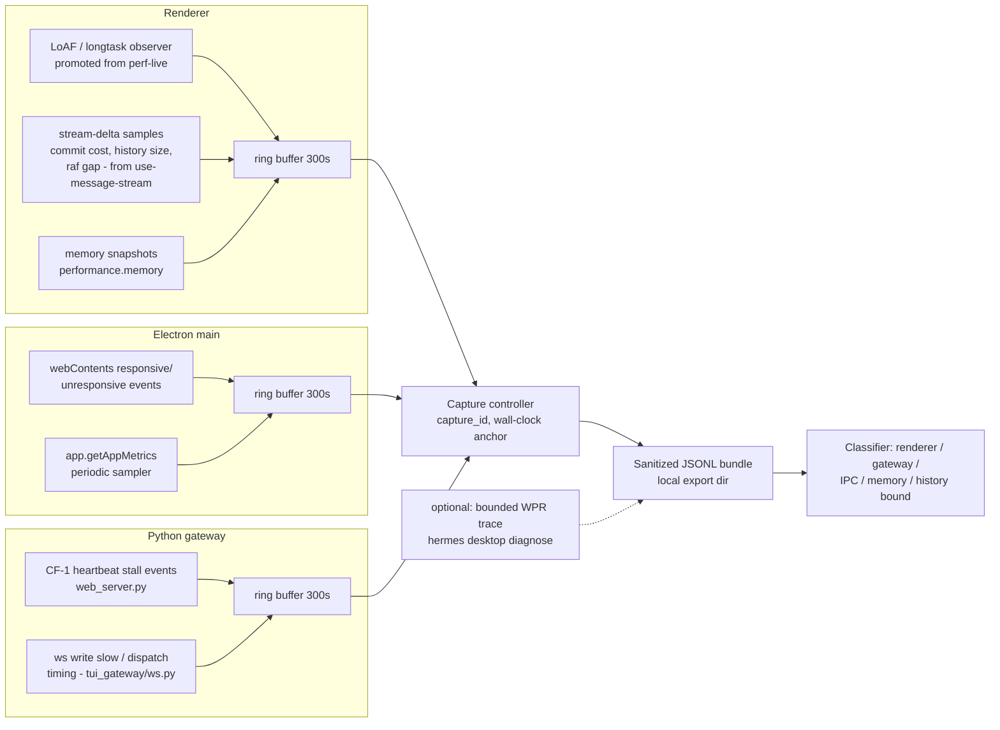

# fix: Make desktop hitching diagnosable and fix confirmed local defects

**Target repo:** hermes-agent (local fork branch `local/openai-native-windows`, candidate worktree `openai-native-windows-candidate-20260806`)

---

## Product Contract

### Summary

Ship an opt-in "capture next hitch" diagnostics capability that attributes a Desktop hitch to renderer, Electron main, or Python gateway within one correlated local bundle, and fix the two defects recon confirmed on this machine (the Kanban permission-error reconnect storm; missing production-visible instrumentation). Speculative hitching fixes (idle render-loop throttling, gateway GIL-stall mitigation) are planned as evidence-gated follow-up units, not blind changes.

### Problem Frame

The user reported "aggressive hitching" in Hermes Desktop (chat session 20260806_111508_ac227a, 2026-08-06 ~11:15 local). Recon against the running build (v0.20.0 / 2026.8.3, built from this worktree) found:

- The chat's strongest suspects are already fixed in this build: streaming cost vs transcript length (upstream #69120, PRs #71835/#71789/#72504 are ancestors of HEAD) and the adaptive-flush measurement bug (upstream #72799 — the rAF commit-cost measurement is present in `apps/desktop/src/app/session/hooks/use-message-stream/index.ts`).
- The gateway event-loop stall class (upstream #58576/#60654, still open) is real on this host (spikes 2026-07-30 ×122 and 2026-08-04 ×71, worst 59.2s) but logged **zero** occurrences on the day of the complaint. Caveat: the CF-1 watchdog only logs drift >5s on a 2s tick (`_hb_stall_threshold = 5.0`, `_hb_interval = 2.0`), so "zero occurrences" excludes only stalls longer than 5s — frequent sub-5s gateway stalls, the range that reads as "hitching" rather than a freeze, are invisible to the current detector. The capture ring in U3 therefore records drift at a much lower floor to close this blind spot.
- The reported hitch is therefore **unattributed**. The only anomalies overlapping the complaint window are: a Kanban `PermissionError` exception storm ("delegate_task child contexts cannot mutate Kanban tasks or boards", every few seconds, 11:28→11:43+), 249 renderer-side "Timed out connecting to Hermes backend after 60000ms" errors in desktop.log, and a ~762–858 MB renderer working set.
- Existing instrumentation (LoAF profiler `apps/desktop/src/debug/perf-live.ts`, `__RENDER_COUNTS__`/`__ATOM_CHURN__` counters, CDP perf harness `apps/desktop/scripts/perf/`) is dev-only and cannot capture a hitch in the packaged production app, where the hitches actually happen.

Without production capture, every future hitch report restarts the same speculative triage. With it, the next hitch yields a defensible attribution ("renderer performed 430ms commits per delta" vs "gateway loop blocked 28s while renderer idled").

### Requirements

- **R1.** An opt-in Diagnostics capture mode works in the packaged production Desktop app (not only dev builds), recording renderer, Electron-main, and gateway signals into ring buffers with a shared capture ID.
- **R2.** A capture can be started before/during a hitch and exported as a sanitized local bundle (sizes, counts, durations, event IDs — no prompt text, tool output, credentials, or paths). No outbound telemetry.
- **R3.** The exported bundle is sufficient to classify a hitch as renderer-bound, gateway-bound, IPC/transport-bound, memory/GC-bound, or history-bound.
- **R4.** The Kanban permission-error reconnect storm no longer occurs: a gateway context classified as a delegate_task child must not retry the mutating event-stream/init path in a tight loop, and the root misclassification on the main gateway process is diagnosed and fixed.
- **R5.** An intentional renderer long-task and an intentional gateway loop stall are each correctly attributed by the capture bundle (proof harness).
- **R6.** Evidence-gated fixes (idle render-loop throttling, gateway stall mitigation) proceed only when a captured bundle implicates their mechanism.

### Scope Boundaries

**In scope:** production diagnostics capture (renderer + main + gateway + correlation + export), Kanban storm fix, proof harness, bounded Windows WPR helper, evidence-gated follow-up fix units.

**Out of scope (true non-goals):**
- Re-fixing issue classes already present in this build (#69120, #72799, #70232).
- Blind adoption of upstream PR #74679's throttling revert (rejected upstream for Windows/Linux occlusion semantics) without local evidence.
- Renaming/refactoring the existing dev-only perf tooling beyond what reuse requires.
- Fixing the ~50 idle low-working-set python worker processes (separate concern, no evidence they hitch the UI).

#### Deferred to Follow-Up Work
- Upstreaming: PRs to NousResearch/hermes-agent for the diagnostics feature and any evidence-proven fix (the fork remotes already exist). Deliberately after local validation.
- The 60s backend-connect timeout errors: captured and correlated by U3, but root-caused only if the diagnostics bundle shows them coinciding with hitches.
- Investigating whether upstream #77257 / #75608 / #73287 apply locally.

### Key Decisions

- **Diagnostics-first over fix-first** — user-confirmed (session-settled: chosen over leading with speculative throttling/gateway fixes). The complaint-day evidence contradicts the chat's top suspects; capturing the next hitch is the highest-value step. Governs R1–R3, R6.
- **Kanban storm fix included** — user-confirmed (session-settled: chosen over tracking separately). Confirmed local defect overlapping the complaint window. Governs R4.
- **Land on local fork branch `local/openai-native-windows`** — user-confirmed (session-settled: chosen over upstream-first PRs). Governs the Deferred upstreaming item.

---

## Planning Contract

### Key Technical Decisions

- **KTD1 — Promote, don't duplicate, existing instrumentation.** The production diagnostics module reuses the mechanisms already proven in `apps/desktop/src/debug/perf-live.ts` (LoAF `PerformanceObserver`, long-frame attribution) and the commit-cost measurement already inside `use-message-stream` (`lastFlushCostRef` rAF pattern), lifting them behind a runtime opt-in flag instead of the build-time `debug/` alias exclusion. Rationale: the hard problems (LoAF attribution, hidden-renderer rAF pitfalls) are already solved there; duplicating them invites drift.
- **KTD2 — Ring buffers + explicit capture, not always-on logging.** Fixed-size in-memory ring buffers (~300s) in renderer, main, and gateway; "start capture"/"export" flushes them. Rationale: hitching is intermittent; always-on file logging adds its own I/O jank and grows unbounded.
- **KTD3 — Correlate by capture_id + monotonic clocks per process, aligned at export.** Each process records `performance.now()`/monotonic timestamps plus a wall-clock anchor at capture start; the exporter aligns streams. Rationale: cross-process clock skew burned the earlier manual triage (the 04:14-local gateway restart was initially misread as 11:14).
- **KTD4 — Gateway side extends the existing CF-1 heartbeat, not a new watchdog.** The stall detector in `hermes_cli/web_server.py` (heartbeat drift logging "event loop stalled") gains a ring-buffer sink and stall-event records consumable by the capture exporter. Same for the `ws write slow` path in `tui_gateway/ws.py`. Rationale: these detectors already fire on real incidents; they only lack a machine-readable, correlated sink.
- **KTD5 — Kanban fix has two halves: stop the loop, then fix the misclassification.** The reconnect loop is a defensive-catch-all + auto-reconnect interaction in `plugins/kanban/dashboard/plugin_api.py`; a `PermissionError` from the delegated-child guard is a *permanent* condition for that process and must terminate/stop retrying, not loop. Separately, the main gateway process being classified as a delegate_task child at all is wrong and must be root-caused (likely an inherited env/context flag). Fixing only the loop would hide the misclassification; fixing only the classification leaves the loop landmine.
- **KTD6 — WPR integration is a thin bounded helper, not a dependency.** A `hermes desktop diagnose` CLI subcommand records the PID tree, starts/stops a time-bounded `wpr.exe` trace, and drops it beside the exported bundle. Capture works fully without it (non-Windows, or WPR unavailable).

### Assumptions

- The packaged app can expose a runtime diagnostics opt-in without the dev CDP port (config flag or local UI toggle); recon confirmed the packaged app deliberately blocks CDP, so the capture UI/flag must be in-app or config-file based.
- The Kanban misclassification is environmental/contextual (the guard itself is presumably correct for real delegated children); if implementation finds the guard logic itself wrong, the fix moves into `hermes_cli/kanban_db.py` instead.
- The running Desktop is rebuilt from this worktree by the existing local build/release flow; the plan does not change packaging.

---

## High-Level Technical Design

Directional guidance: the capture controller lives in Electron main (it can reach both the renderer via IPC and the gateway via the existing WS/API channel); the classifier is a post-processing step over the bundle, not a live component.

---

## Implementation Units

### U1. Stop the Kanban permission-error reconnect storm

**Goal:** The dashboard Kanban event stream stops retry-looping on the delegated-child `PermissionError`, and the main gateway process is no longer misclassified as a delegate_task child.

**Requirements:** R4.

**Dependencies:** none (independent; do first — it is cheap and removes a confound from every future capture).

**Files:** `plugins/kanban/dashboard/plugin_api.py`, `plugins/kanban/dashboard/dist/index.js` (client reconnect loop — locate and edit the bundle's source of truth if `dist/` is generated), `hermes_cli/kanban_db.py`, `tests/plugins/test_kanban_dashboard_plugin.py`.

**Approach:**
1. Diagnose the misclassification as a **decision point, not a pre-committed conclusion**: determine whether the delegated-child marker reaches the dashboard worker via `os.environ` inheritance (`HERMES_DELEGATED_CHILD_CONTEXT`) or via ContextVar propagation into a dashboard-serving asyncio task. If the guard is correctly flagging a leaked scope, the fix restores correct scoping (e.g., contextvar reset at request entry) — the guard assertion itself is left unchanged. The fix must not clear or narrow the delegated-child marker for any process spawned under a real delegated child.
2. Server side: make the event-stream error handler treat `PermissionError` from the guard as permanent for the process: close with a distinct terminal code/reason and log once, not per attempt (per KTD5). Same terminal treatment for the `init_db failed` path.
3. Client side: the reconnect loop lives in the dashboard bundle — `ws.onclose` treats only close code 1008 as terminal and otherwise re-opens with backoff that `ws.onopen` resets to 1000ms on every successful upgrade (this is why the storm repeats every few seconds). Add a terminal branch for the new server close code with a distinct non-auth error string; do not re-open on it.

**Patterns to follow:** the existing `CancelledError` special-case in the same handler shows the established pattern for distinguishing exception classes in the stream loop.

**Test scenarios:**
- A dashboard event-stream connection in a genuinely delegated-child context receives a terminal close and the server does not re-log the error on an immediate reconnect attempt (input: simulated delegated-child context + reconnecting client; expected: one warning, terminal close code, no per-reconnect log lines).
- The main gateway process context passes the delegated-child guard (input: default gateway startup environment; expected: `init_db` and mutations succeed) — this must be achieved by fixing the marker's propagation, never by loosening the guard assertion.
- Real-lineage regression: spawn a delegated child through the actual delegate_task subprocess-env path and assert both the direct child and one grandchild subprocess are still rejected on Kanban mutation; assert the fix does not clear or narrow `HERMES_DELEGATED_CHILD_CONTEXT` for processes spawned under a child.
- Client terminal branch: on the new close code the dashboard does not reconnect and surfaces a distinct non-auth error string; on ordinary transient closes the existing backoff behavior is unchanged.

**Verification:** with the fix running, `errors.log` shows zero recurring `Kanban event stream error: delegate_task child contexts...` lines over an hour of dashboard use; Kanban board loads and mutates normally from the desktop.

---

### U2. Renderer diagnostics module (production-gated capture)

**Goal:** A production-safe renderer module records LoAF/long-task entries, per-flush stream-delta samples, RAF-gap and memory snapshots into a ring buffer when diagnostics mode is enabled.

**Requirements:** R1, R2, R3.

**Dependencies:** none (parallel with U1).

**Files:** new `apps/desktop/src/diagnostics/` module; touch points in `apps/desktop/src/app/session/hooks/use-message-stream/index.ts` (emit the already-measured flush/commit cost + queue depth + history size into the ring buffer); `apps/desktop/src/debug/perf-live.ts` (extract shared observer logic rather than importing the dev-only module); tests beside the new module.

**Approach:**
1. Extract the LoAF observer + attribution core from `perf-live.ts` into a shared, production-buildable helper; `perf-live.ts` becomes a dev-mode consumer of it (per KTD1).
2. Ring buffer (bounded count + bytes, ~300s) storing typed events: `long_frame`, `stream_delta_applied` (history message count, mounted count, payload chars, receive-to-apply, commit cost, raf gap), `memory_sample`.
3. Gate on a runtime opt-in (config flag readable by the packaged app + a local toggle surface added in U4). Zero observers registered when off.
4. Sanitization at record time, not export time: only sizes/counts/durations/IDs enter the buffer (per R2).

**Execution note:** verify overhead first — with diagnostics ON and a long streaming session, the module's own cost must stay negligible (no new long tasks attributable to it); this is packaging/instrumentation work, prefer runtime smoke proof plus targeted unit tests over broad coverage.

**Test scenarios:**
- Ring buffer evicts oldest entries at capacity without unbounded growth (input: events beyond capacity; expected: bounded length, oldest dropped).
- `stream_delta_applied` events carry counts/durations only — a synthetic delta containing marker text never lands any of that text in the buffer (sanitization proof).
- Diagnostics off → no `PerformanceObserver` registered, no per-delta recording work (input: default config; expected: zero instances).
- A forced 200ms synthetic long task while enabled produces a `long_frame` event with attribution fields populated.

**Verification:** in a packaged build with the flag on, the buffer fills during a streamed reply; with the flag off, profiling shows no diagnostics work on the delta path.

---

### U3. Main-process and gateway diagnostics + correlation

**Goal:** Electron main and the Python gateway record their boundary signals into ring buffers; a capture controller in main assigns a capture_id and wall-clock anchor to all three streams.

**Requirements:** R1, R3.

**Dependencies:** U2 (shares event schema and capture_id contract).

**Files:** Electron main process sources under `apps/desktop` (main-side: `webContents` responsive/unresponsive hooks, `app.getAppMetrics` sampler, capture controller + IPC); `hermes_cli/web_server.py` (CF-1 heartbeat gains a ring-buffer sink and structured stall events, per KTD4); `tui_gateway/ws.py` (`ws write slow` and token-flush timing emit structured events); Python tests beside the touched gateway modules.

**Approach:**
1. Main: subscribe `unresponsive`/`responsive`, sample `app.getAppMetrics` at a low fixed rate while capture is armed; ring buffer as in U2.
2. Gateway: while capture is armed, record **every heartbeat drift sample above a low capture floor (~250ms)** into the in-memory ring (shortening the heartbeat interval for the armed window); the existing 5s "event loop stalled" log warning is unchanged. This closes the sub-5s blind spot the Problem Frame caveat describes. `ws write slow` events join the ring with peer/stream identifiers protected by **HMAC-SHA256 under a random per-capture key never written into the bundle** (correlates within one bundle, non-reversible outside it).
3. Stall attribution: a capture-armed watchdog **thread** (independent of the event loop) captures the main thread's stack via `sys._current_frames()` / `faulthandler`-style sampling when drift exceeds the ring floor, and records a sanitized frame summary (module/function/line only) on the stall event — without this, a gateway-bound bundle can say "loop blocked Ns" but never name the blocking work, leaving U7 permanently gated.
4. Ring exposure: the capture controller pulls the gateway ring **over the gateway's existing authenticated WS/API channel — no new unauthenticated listener**. If a separate endpoint proves unavoidable, it must bind 127.0.0.1 only, require a per-capture random bearer token minted by the capture controller at arm time, and reject cross-origin requests. The gateway stream is supported only for the locally-spawned backend; when the active connection is a remote/SSH gateway, the capture controller skips the ring pull and the exporter marks the stream absent with reason `remote-gateway` (reusing U4's absent-stream path).
5. Capture controller (main): start/stop, capture_id generation, wall-clock + monotonic anchor exchange with renderer (IPC) and gateway (existing channel) per KTD3. Renderer connect/timeout errors (the observed 60s `hermes:api` timeouts) are recorded as transport events so IPC/transport-bound hitches are classifiable.
6. Arming is **live**: the renderer module subscribes to an IPC arm/disarm message from the capture controller and registers/tears down its observers on that edge; the config flag only sets the boot-time default. No restart is required to capture — a restart would discard the long-lived session state (accumulated timeouts, renderer working set) the reported hitch correlates with.

**Test scenarios:**
- A gateway stall event recorded during capture appears in the pulled ring with duration and monotonic timestamp (input: artificially blocked loop above the ~250ms capture floor; expected: structured event present) — including a **sub-second** block (~400ms), which must land in the ring even though it never reaches the 5s log threshold.
- A stall event above the floor carries a sanitized frame summary naming the blocking call site (module/function/line, no arguments or paths).
- An unauthenticated local caller attempting to pull the gateway ring while a capture is armed is refused.
- With a remote-gateway connection active, capture completes with the gateway stream marked absent (`remote-gateway`), and no ring pull is attempted.
- Clock alignment: two processes anchored at capture start reconstruct a known event ordering across streams (input: scripted events with known relative timing; expected: aligned ordering within tolerance).
- Capture off → gateway ring endpoint refuses/is absent; no metrics sampling in main.
- A renderer→backend timeout during capture yields a transport event tagged with the capture_id.

**Verification:** a manual capture during a live streamed reply produces three non-empty, time-aligned streams for one capture_id.

---

### U4. Capture UX, sanitized export, and bounded WPR helper

**Goal:** One-action "capture next hitch" flow: arm, record, export a sanitized bundle directory/zip locally; optional bounded WPR trace on Windows.

**Requirements:** R2, R3 (bundle + classification inputs), KTD6.

**Dependencies:** U2, U3.

**Files:** Desktop settings/diagnostics surface under `apps/desktop/src` (opt-in toggle + start/stop/export controls); exporter in the main-process diagnostics module; new `hermes desktop diagnose` CLI subcommand in `hermes_cli/` (PID tree snapshot, `wpr.exe -start`/`-stop` with a hard timeout, artifact placement beside the bundle); docs entry under `docs/` describing the flow and what the bundle contains.

**Approach:**
1. UI: a local-only Diagnostics section (settings or hidden panel) with Start capture / Stop & export; status shows buffer fill and capture_id.
2. Exporter: writes JSONL per stream + a manifest (capture_id, anchors, app version, process tree) to a local directory; includes a post-processing classification summary (renderer/gateway/IPC/memory/history-bound heuristics over the streams, per R3). The **manifest is inside the sanitization contract**: the process tree records PID, PPID, and executable basename only — never argv or full paths (command lines routinely carry tokens and secrets).
3. CLI diagnose subcommand (place under the existing `hermes debug` group rather than a new namespace): orchestrates the same capture headlessly + optional WPR; degrades gracefully when WPR is unavailable. The **WPR ETL trace is explicitly outside the sanitized bundle**: it is a system-wide kernel capture (other processes' activity, image paths, command lines), so it is written to a separate directory beside the bundle, produced only on a separate per-invocation opt-in, and labeled in the docs entry as unsanitized and unsafe to share.

**Test scenarios:**
- Export produces a manifest whose stream files parse and share the capture_id (happy path).
- Export with an empty gateway ring (gateway unreachable) still succeeds and marks the stream absent (error path).
- WPR helper: unavailable `wpr.exe` → capture completes, WPR marked skipped; a stuck `wpr` invocation is killed at the hard timeout (failure path).
- Manifest sanitization: no argv field or full path appears anywhere in the manifest; a process launched with a marker string in its command line never lands that string in the bundle.
- Classification summary labels a bundle containing only renderer long-frame spikes as renderer-bound, and one containing only gateway stalls as gateway-bound (uses U5 fixtures).

**Verification:** on this machine, running one real capture during normal streaming produces a bundle a reviewer can open and read the classification summary from, with no user content inside (spot-grep the bundle for known chat phrases).

---

### U5. Proof harness: synthetic hitches must classify correctly

**Goal:** The perf harness gains scenarios that intentionally create (a) renderer long tasks and (b) a gateway event-loop stall, and asserts the exported bundle attributes each correctly.

**Requirements:** R5.

**Dependencies:** U2, U3, U4.

**Files:** `apps/desktop/scripts/perf/` (new scenario alongside `stream-history.mjs` and `render-churn.mjs`); a gateway-side test hook to block the loop briefly (test-only, guarded); assertions on the exported bundle.

**Approach:** follow the existing CDP harness scenario pattern; the renderer stall injects a busy-loop long task during streaming; the gateway stall uses a guarded test hook to hold the loop past the CF-1 threshold. Each scenario runs a capture and asserts the classifier's label.

**Test scenarios:**
- Injected 300ms renderer busy-loop during streaming → bundle classified renderer-bound; gateway stream shows no stall.
- Injected 6s+ gateway loop block → bundle classified gateway-bound; renderer stream shows idle/normal frames.
- Injected ~1s gateway loop block (below the 5s log threshold) → still classified gateway-bound, proving the ring's low capture floor closes the CF-1 blind spot.
- Combined injection → classifier reports both, not a single confident wrong label.

**Verification:** both scenarios pass in CI/locally against a packaged-equivalent build; this is the plan's Definition-of-Done gate for the diagnostics track.

---

### U6. Evidence-gated: hidden-renderer throttling for the idle render-loop family

**Goal:** If (and only if) a captured bundle implicates the idle render-loop mechanism (upstream #73082/#53902/#51927: anti-throttling flags keeping hidden renderers at foreground cadence), apply a Windows-safe throttling fix locally.

**Requirements:** R6.

**Dependencies:** U4, U5 (regression baseline for the evidence-gated fix; the implicating captured bundle must show idle long-frame/GPU churn while hidden or occluded).

**Files:** `apps/desktop/electron/stream-throttle.ts`, `apps/desktop/electron/main.ts` (residual `backgroundThrottling: false` near line 8966), `apps/desktop/electron/wake-indicator-window.ts` (residual `backgroundThrottling: false`).

**Approach:** the upstream mechanism (#74679's flag revert) is **already landed in this build** — the process-wide anti-throttling flags were removed and `stream-throttle.ts` implements a runtime dial (unthrottled only while a turn streams, re-throttled after a trailing delay). Rescope to the gaps that remain locally: the Windows occlusion-recovery signal (occluded windows never fire `visibilitychange`, so recovery must also key on Electron occlusion/focus events), the two residual static `backgroundThrottling: false` sites named above, and the trailing re-throttle window. Keep the streaming-while-hidden delta path working (the `setTimeout`-not-rAF flush design in `use-message-stream` anticipates hidden renderers — preserve it).

**Test scenarios:**
- Hidden/occluded window: frame production drops to throttled cadence; on re-show/un-occlude, streaming content is current within one flush interval (no frozen backlog).
- Streaming continues to apply deltas (store-side) while hidden; no missed messages after 10 minutes hidden.
- Idle CPU of a hidden session window is measurably lower than before the change on this machine.

**Verification:** captured before/after bundles on this machine show the idle long-frame churn gone; no streaming regression in U5 scenarios.

---

### U7. Evidence-gated: gateway stall mitigation

**Goal:** If a captured bundle attributes a hitch to the gateway loop (the #58576 class recurs — worst local incident 59.2s on 2026-08-04), reduce or eliminate the stall source.

**Requirements:** R6.

**Dependencies:** U4, U5 (regression baseline for the evidence-gated fix; the implicating captured gateway-bound bundle should identify what blocked the loop — the U3 stall events should carry enough context to name the offending work).

**Files:** to be determined by the captured evidence — candidates from recon: `hermes_cli/web_server.py` (loop-adjacent heavy work), `tui_gateway/ws.py` (write path), CPU-bound work running on loop threads elsewhere in `hermes_cli/`.

**Approach:** deferred implementation notes only — the stall's cause is an execution-time unknown by design. Likely shapes: move GIL-heavy work to a process pool, add executor offload at the identified call site, or bound payload serialization. Do not pre-commit to the upstream community `sitecustomize.py` workaround (already moot locally — selector policy is active).

**Test scenarios:** to be defined against the identified cause; must include a regression run of the U5 gateway-stall scenario and a re-capture showing the stall class gone under the reproducing workload.

**Verification:** the CF-1 heartbeat logs no stall ≥5s under the previously reproducing workload for a week of normal use.

---

## Verification Contract

- U5's two synthetic-hitch scenarios are the acceptance gate for the diagnostics track (R1–R3, R5).
- U1 is verified by absence of the storm signature in `errors.log` during an hour of dashboard use plus the unit's tests (R4).
- U6/U7 fire only with a captured implicating bundle attached to the work (R6); each must re-run U5 as regression.
- All Python tests via the repo's existing test runner; desktop tests via the existing app test setup; perf scenarios via the existing `scripts/perf` harness entry point.

## Definition of Done

1. Kanban storm eliminated on this machine (U1 verification).
2. A packaged build with diagnostics enabled captures and exports a correlated, sanitized, classified bundle (U2–U4).
3. Both U5 synthetic scenarios classify correctly.
4. U6/U7 either executed with evidence or explicitly parked with their gating condition documented.
5. Work landed as reviewable commits on `local/openai-native-windows`; upstreaming decisions recorded in Deferred follow-up.
6. Diagnostics armed on this machine for a real-use soak window (target: 7 days), with the soak start recorded; any real user-reported hitch during the window is captured and classified, or the window closes with no reported hitch — recorded either way. (Window closure may post-date the code landing; initiating and recording the soak is the in-plan deliverable.)

---

## Sources & Research

- Recon dossier (verified findings, 2026-08-06): scratchpad `recon-dossier-hitching.md` — session logs, process measurements, upstream issue states, local fix presence. Load-bearing: it reversed the chat's fix-first framing.
- Hermes chat 20260806_111508_ac227a (hermes state.db) — original problem statement and proposed diagnostics deliverable.
- Upstream: #58576/#60654 (open, gateway stalls), #73082/#53902/#51927 + rejected PR #74679 (idle render loop), #69120 fixed by #71835/#71789, #72799 (fixed locally), #68467 (closed; bounding code present locally), #65329 (open upstream turn-trace PR — overlapping intent, watch for convergence when upstreaming).
- Existing local instrumentation: `apps/desktop/src/debug/perf-live.ts`, `apps/desktop/scripts/perf/`, CF-1 heartbeat in `hermes_cli/web_server.py`, coalescing/write-timeout in `tui_gateway/ws.py`.
