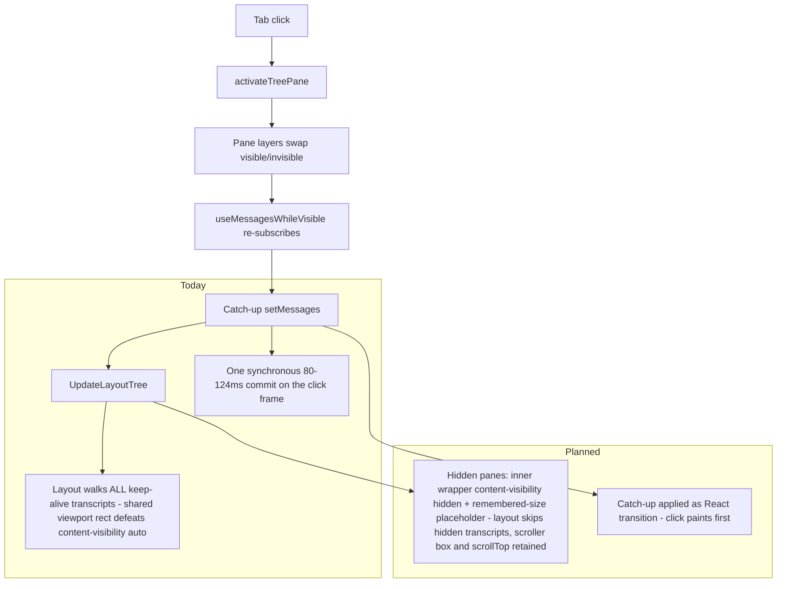
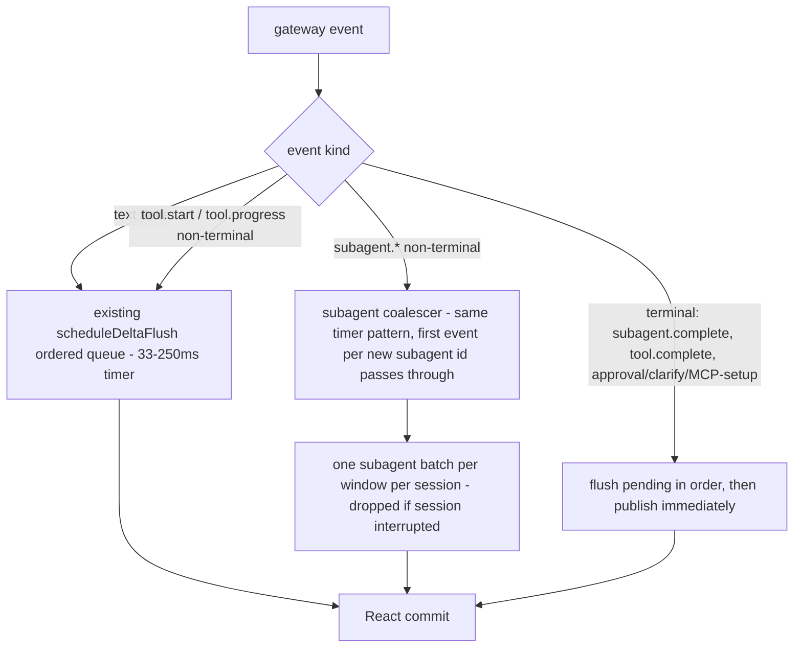

# Desktop Dropped Frames - Hidden-Pane Containment and Stream Coalescing - Plan

## Goal Capsule

- **Objective:** Eliminate the residual dropped-frame classes identified by the 2026-08-13 RCA — pane-switch jank from keep-alive layers that stay in layout, and subagent-streaming jank from uncoalesced publishes — without touching the inflight-turn journal.
- **Authority hierarchy:** The RCA verdict is settled input (do not re-litigate unless new traces or a changed HEAD contradict it). `AGENTS.md` and `apps/desktop/AGENTS.md` rules override implementation preferences. This plan's KTDs bind mechanism choices; unit Approach fields carry only unit-local detail.
- **Execution profile:** Implement in a fresh worktree on branch `fix/desktop-dropped-frames` cut from `fork-integration` tip `7d094ca31`. Never edit the stale detached-HEAD checkout or the dirty root `AGENTS.md`.
- **Stop conditions:** Stop and report instead of proceeding if: a unit requires changing journal code (`apps/desktop/src/lib/inflight-turn-journal.ts`); a unit requires weakening the `data-pane-hidden` lookup contract; scroll retention cannot be preserved by any containment variant; or any step would push, merge to `fork-integration`, or trigger the release/update path.
- **Tail ownership:** This run ends at a locally verified branch. Push, PR, integration into `fork-integration`, and release/publish are user decisions.

---

## Product Contract

### Summary

Pane switches between already-open keep-alive tabs drop ~51% of frames (6.7 s style+layout in a 15 s window); subagent streaming drops ~79% (8.7 s style+layout, most frames never drawn). Both are layout/publish costs, not journal costs. This plan contains hidden-pane transcript content so layout stops scaling with hidden siblings, spreads the reveal catch-up commit off the click frame, coalesces subagent/tool publishes onto the existing delta-batching pattern, and stops per-tick full re-serialization of tool args.

### Problem Frame

The desktop keeps every ever-active pane mounted (`visibility: hidden` + `absolute inset-0`) so panes resume instantly and scroll positions survive. The cost: `content-visibility: auto` cannot skip hidden transcripts because they share the viewport rect, so every style/layout pass pays O(N tabs × transcript size). On reveal, the hidden pane catches up with one synchronous `setMessages` commit (80–124 ms per click). During subagent streaming, every `subagent.*` event and every parent `tool.*` event publishes immediately — parent tool events even eagerly flush the text-delta batch — producing 128–176 ms `UpdateLayoutTree` tasks and 8.2 s drop clusters. Journal v2 is already landed and contributed zero hits in either trace.

### Requirements

**Pane switching**

- R1. Hidden keep-alive panes must not contribute their transcript content to style/layout passes; pane-switch layout cost must stop scaling with the size of hidden siblings' transcripts.
- R2. Each pane's scroll position survives a hide/reveal round-trip.
- R3. The `data-pane-hidden` attribute contract and `pane-visibility.ts` lookups (`isElementInHiddenPane`, `queryAllVisible`, `queryVisible`) keep working unchanged.
- R4. Revealing a pane must not apply the frozen transcript catch-up as one synchronous commit on the click frame; the click's input-to-paint stays bounded while the full transcript still arrives. During the pending catch-up the pane keeps showing its frozen pre-hide transcript in place — no blanking, no skeleton — and updates in place when the catch-up commits.

**Subagent / tool streaming**

- R5. Subagent and non-terminal parent tool events coalesce into batched publishes (~33 ms floor, adaptive, ≤250 ms gap); terminal transitions (`subagent.complete`, `tool.complete`, approval/clarify/MCP-setup requests) publish immediately. A session stop, interrupt, or teardown landing mid-window discards that session's buffered non-terminal state instead of applying it late.
- R6. Coalesced publishes keep delivering while the window is hidden, minimized, or occluded (timer-scheduled, never rAF-only).
- R7. `tool.progress` ticks must not re-serialize the full accumulated args object on every event.

**Cross-cutting**

- R8. No user-visible content changes: transcripts, tool output, and subagent rows render the same content as today, just cheaper.
- R9. The containment change (R1) can be disabled at runtime via a localStorage kill switch without a rebuild, following the `hermes.desktop.inflightTurnJournal.disabled` precedent.

### Scope Boundaries

**In scope:** the four mechanisms above, their tests, and diagnostics emission through the existing perf-mark events.

**Deferred to Follow-Up Work**

- Truncating or summarizing oversized in-memory tool `result`/`argsText` for the live tail (product-visible; needs its own design).
- Upstream PR submission to `NousResearch/hermes-agent` (cut later from an upstream-based worktree per `docs/solution-fork-upstream-canonicalization.md`; keep this diff generic to enable it).
- Integration into `fork-integration`, canary, and release/update publication (user-owned, fail-closed release gates).
- Electron `backgroundThrottling` / gateway-stall follow-ups (parked as U6/U7 of `docs/plans/2026-08-06-001-fix-desktop-hitching-diagnostics-plan.md`; different mechanism family).
- Disposition of the two stale-HEAD commits without patch-identity matches in the rebuilt branch (`156931078` updater process ownership, `f94cb5280` diagnostics ring) — flag to the user, do not cherry-pick here.

**Outside this product's identity:** re-implementing the inflight-turn journal or merging upstream PR #82832 as a fix for these traces.

### Assumptions

- Scope covers all four residual RCA fix classes (containment, reveal catch-up, publish coalescing, per-tick serialization) rather than containment alone; the user's "pick what we have here" is read as adopting the RCA's residual fix menu, minus the deferred content-truncation item.
- The implementation base is `fork-integration` tip `7d094ca31`, not the detached HEAD this session started on; RCA code citations were re-verified there (8 of 11 cited files byte-identical; the 3 drifted files drifted in unrelated hunks).
- Nothing is pushed and no release is triggered in this run.

---

## Planning Contract

Key Technical Decisions:

- KTD1. **Base and branch.** Work happens on `fix/desktop-dropped-frames` cut from `fork-integration` `7d094ca31` in a fresh worktree (session-settled: user-approved — chosen over continuing on the detached HEAD: that lineage predates the 2026-08-13 branch rebuild and 78/80 of its unique commits already exist in the rebuilt branch by patch identity).
- KTD2. **No journal work.** The inflight-turn journal and PRs #82832/#80872 are out of scope (session-settled: user-approved — chosen over merging #82832 as the fix: both traces were captured on a journal-v2 build and contain zero journal hits).
- KTD3. **Containment mechanism.** Add an inner content wrapper inside each keep-alive pane layer. The wrapper carries `contain-intrinsic-size: auto <fallback>` **permanently**: CSS records the last-remembered size only while an element has that property AND is not skipping its contents, so applying it at hide time would never record anything and every hide would collapse to the static fallback (the cited `thread/list.tsx:286` precedent works precisely because the property is present while the content renders unskipped). On hide, toggle **only** `content-visibility: hidden`; the size remembered while visible then keeps the scroller's `scrollHeight` — and so `scrollTop` — stable. The wrapper must not force extrinsic height (grow via `min-h-full`-style sizing, never `h-full`, which would override the intrinsic placeholder). The outer `absolute inset-0 overflow-auto` scroller and its `data-pane-hidden` attribute stay exactly as today, preserving R3. Chosen over `display: none` or unmounting (breaks implicit scroll retention and instant resume) and over `content-visibility: hidden` directly on the scroller (collapses `scrollHeight`, clamping `scrollTop` to 0). Guards: the first hide after a reload has only the fallback (no remembered size yet), and jsdom cannot prove real-layout behavior — if `scrollTop` proves unstable in real layout, add explicit scroll save/restore on hide/reveal; R2 is the acceptance bar, the CSS trick is only the preferred vehicle. Runtime kill switch `hermes.desktop.hiddenPaneContainment.disabled` (R9; kept deliberately for a CSS-only change because the update loop ships `fork-integration` straight to the daily-driver install — a no-rebuild disable is cheap insurance).
- KTD4. **Reveal catch-up.** Keep the synchronous re-subscribe in `useMessagesWhileVisible` (correctness: nanostores emits current value on subscribe) but mark the catch-up state application as a React transition so the click frame paints before the full-transcript commit. Chosen over idle-time incremental apply: far smaller diff, and containment (KTD3) already removes most of the layout half of the click cost. During the pending transition the frozen pre-hide transcript stays rendered and interactive (R4), and the reveal anchors to the pane's retained `scrollTop` rather than re-evaluating a bottom-follow, so a user scrolling stale content is not yanked when the catch-up commits (R2).
- KTD5. **Publish coalescing.** Two distinct paths, both timer-scheduled (never rAF — Chromium parks rAF for occluded renderers, and `delta-flush.test.tsx` pins timer delivery while frames are parked):
  1. Non-terminal `tool.start`/`tool.progress` events enqueue as ordered entries (text | tool-upsert) in the **existing per-session queued-deltas pipeline**, drained by the one `scheduleDeltaFlush` timer (`use-message-stream/index.ts:316-437`), so a single flush applies text and tool upserts in arrival order. Two independent timers are not acceptable: `appendStreamPart` (`chat-messages.ts:422-446`) bounds a streaming segment at any tool part, so a tool upsert landing ahead of earlier-queued text would permanently render that text below the tool card, violating R8.
  2. Non-terminal `subagent.*` payloads — which write to the subagents store, not message parts, and carry no parts-ordering constraint — buffer in a per-session coalescer with the same timing profile (33 ms floor, adaptive cost feedback, 250 ms max gap). The first event for a not-yet-seen subagent id passes straight through so new delegate rows still appear individually as they start.

  Terminal events (`subagent.complete`, `tool.complete`, approval/clarify/MCP-setup requests) and turn-boundary events flush pending queued state first, then apply immediately. Flush handlers re-check `sessionInterrupted` at flush time (mirroring the delta flusher at `use-message-stream/index.ts:576`) and drop buffered non-terminal payloads for interrupted or torn-down sessions; buffers and pending timers clear on hook unmount and session resume/swap. Emit through the existing diagnostics events (`gateway_event_applied` / a sibling `subagent_event_applied`) rather than new counters.
- KTD6. **Landing path.** The branch stays fork-local and generic (no fork-only release wiring in the diff) so it can later feed both `fork-integration` integration and an upstream PR per the four-boundary pattern in `docs/solution-fork-upstream-canonicalization.md`. This run does not push, merge, or release.

### High-Level Technical Design

Pane-switch path, before and after containment:

Streaming publish path with the coalescer:

---

## Implementation Units

### U1. Hidden-pane content containment

- **Goal:** Hidden keep-alive panes stop contributing transcript content to layout while keeping their scroller box, attribute contract, and scroll position.
- **Requirements:** R1, R2, R3, R9.
- **Dependencies:** none.
- **Files:** `apps/desktop/src/components/pane-shell/tree/renderer/tree-group.tsx` (hidden-layer JSX at ~596-648), `apps/desktop/src/components/pane-shell/pane-visibility.ts` (policy comment update + kill-switch helper), colocated tests `apps/desktop/src/components/pane-shell/pane-visibility.test.ts` and a new `apps/desktop/src/components/pane-shell/tree/renderer/tree-group-containment.test.tsx`.
- **Approach:**
  1. Wrap pane-layer children in an inner content div that permanently carries the `contain-intrinsic-size` class with intrinsic (not extrinsic) sizing per KTD3; when `!isActive` (and the kill switch is off), toggle only the `content-visibility: hidden` class.
  2. Keep the outer div's classes and `hiddenPaneProps` untouched.
  3. Read the kill switch once per mount via a small helper in `pane-visibility.ts` (localStorage key per R9), mirroring the journal kill-switch idiom.
  4. Update the `pane-visibility.ts` header comment to document the new containment layer and its invariants.
- **Patterns to follow:** `apps/desktop/src/components/assistant-ui/thread/list.tsx:286` already pairs `[contain-intrinsic-size:auto_37.5rem]` with `[content-visibility:auto]` — reuse that Tailwind arbitrary-property style.
- **Test scenarios:**
  - Hidden layer renders `content-visibility: hidden` on the inner wrapper; active layer does not; the `contain-intrinsic-size` class is present in both states.
  - `hiddenPaneProps`/`data-pane-hidden` still present on the outer layer when hidden (Covers R3).
  - `queryAllVisible`/`queryVisible`/`isElementInHiddenPane` behave identically with the wrapper present (Covers R3).
  - Kill switch set → containment classes absent while keep-alive semantics remain.
  - Scroll retention: scroller with forced dimensions keeps `scrollTop` across hide → reveal with containment applied; if jsdom cannot express this, assert the remembered-size placeholder contract and add the real-layout check to the electron/e2e project instead.
- **Verification:** focused vitest green; a manual pane-switch on a deep transcript no longer pays layout proportional to hidden siblings (observable via `gateway_event_applied`/DevTools if re-traced).

### U2. Reveal catch-up off the click frame

- **Goal:** Pane reveal applies the frozen transcript catch-up without blocking the click's paint.
- **Requirements:** R4, R8.
- **Dependencies:** none (independent of U1; both improve the same click).
- **Files:** `apps/desktop/src/app/chat/index.tsx` (`useMessagesWhileVisible`, ~181-205), new test `apps/desktop/src/app/chat/use-messages-while-visible.test.tsx`.
- **Approach:** keep the subscribe-on-visible structure; route the catch-up `setMessages` through `startTransition` (subsequent streaming updates while visible stay synchronous as today). Do not change the hidden-tab unsubscribe behavior. Per R4 the frozen pre-hide transcript stays rendered and interactive until the transition commits; per KTD4 the reveal anchors to the retained `scrollTop` (no bottom-follow re-evaluation) so scrolling during the pending transition is not yanked by the deferred commit.
- **Patterns to follow:** existing hook tests under `apps/desktop/src/app/session/hooks/use-message-stream/` for rendering-hook test setup.
- **Test scenarios:**
  - Hidden pane does not re-render on `$messages` updates (existing behavior, now pinned — this surface has no tests today).
  - On reveal, the current store value arrives (eventually consistent) and equals `$messages.get()`.
  - Frozen pre-hide content remains rendered (not cleared) for the duration of the pending transition (Covers R4).
  - Scrolling during the pending transition: the final `scrollTop` is unaffected by the deferred commit (Covers R2).
  - Updates arriving while visible still apply promptly.
- **Verification:** focused vitest green; in a re-trace, click `EventDispatch` no longer carries the full catch-up commit AND the first `UpdateLayoutTree` after reveal (the transition-commit frame) stays bounded — the cost must shrink, not merely move one frame later.

### U3. Coalesce subagent and non-terminal tool publishes

- **Goal:** Subagent bursts and parent tool progress stop publishing per-event; terminal transitions stay immediate.
- **Requirements:** R5, R6, R8.
- **Dependencies:** none.
- **Files:** `apps/desktop/src/app/session/hooks/use-message-stream/gateway-event.ts` (subagent routing ~919-936, tool.start/progress ~855-865), `apps/desktop/src/app/session/hooks/use-message-stream/utils.ts` or a new sibling `subagent-coalesce.ts`, `apps/desktop/src/store/subagents.ts` (`upsertSubagent` 256-276) only if batch-apply needs a bulk setter, new test `apps/desktop/src/app/session/hooks/use-message-stream/subagent-coalesce.test.tsx`.
- **Approach:**
  1. Buffer non-terminal `subagent.*` payloads per session; flush through one `upsertSubagent` batch per timer window (KTD5 path 2). The first event for a not-yet-seen subagent id applies immediately so new delegate rows appear as they start.
  2. Enqueue non-terminal `tool.start`/`tool.progress` as ordered entries in the existing queued-deltas pipeline so a single flush applies text and tool upserts in arrival order (KTD5 path 1). `tool.complete` and every input-request event keep today's eager flush-then-apply ordering.
  3. Re-check `sessionInterrupted` at flush time and drop buffered non-terminal payloads for interrupted sessions (terminal frames still apply, matching today's enqueue-time guard semantics at `gateway-event.ts:920-924`); clear per-session buffers and pending timers on hook unmount and session resume/swap; turn-boundary events flush buffers.
  4. Emit the batch-apply through the existing diagnostics path (KTD5) so eager-vs-timer classification keeps working.
- **Execution note:** start with a failing test mirroring `delta-flush.test.tsx`'s parked-rAF scenario for the new coalescer.
- **Patterns to follow:** `scheduleDeltaFlush` (`use-message-stream/index.ts:316-437`) — adaptive floor, timer scheduling, post-flush rAF cost probe; `apps/desktop/AGENTS.md` "coalesce noise, flush signal".
- **Test scenarios:**
  - N rapid `subagent.progress` events → one store publish within the window; final state equals last event.
  - First `subagent.*` event for a new subagent id renders immediately; subsequent progress for the same id coalesces.
  - `subagent.complete` publishes immediately even mid-window, after pending buffered state.
  - Text delta, then `tool.start`, then text delta within one window: parts render in arrival order (Covers R8).
  - `tool.progress` burst coalesces; `tool.complete` flushes pending deltas first and applies immediately (ordering vs text stream preserved).
  - A stop/interrupt landing mid-window: no running-state upsert applies after the stop (Covers R5).
  - Delivery continues with animation frames parked (Covers R6).
  - Approval/clarify/MCP-setup requests are never delayed.
- **Verification:** focused vitest green including the parked-rAF scenario; re-traced subagent run shows batched `UpdateLayoutTree` instead of per-event tasks.

### U4. Stop per-tick full re-serialization of tool args

- **Goal:** `tool.progress` ticks stop paying `JSON.stringify` of the whole accumulated args object per event.
- **Requirements:** R7, R8.
- **Dependencies:** U3 (coalescing reduces tick frequency; this removes the per-tick cost that remains).
- **Files:** `apps/desktop/src/lib/chat-messages.ts` (`toolArgs` 660-671, `upsertToolPart` 692-729, `argsText` at ~718), `apps/desktop/src/lib/chat-messages.test.ts`.
- **Approach:** make `toolArgs` identity-preserving — return the previous args object by reference when an event contributes no new keys/context/preview/todos — then reuse the previous `argsText` whenever `args === prevArgs`; accept one `JSON.stringify` per flush window when args genuinely grew (U3 already bounds the frequency). A getter-based lazy `argsText` is not viable: `upsertToolPart`'s object spread evaluates getters on every upsert. Keep the serialized shape identical for consumers; no truncation — content parity per R8. Re-measure after U3 lands: if coalescing alone already reduces serialization to once per flush window, fold the identity check into the flush handler rather than building standalone memoization.
- **Test scenarios:**
  - Repeated progress events with unchanged args do not produce new `argsText` computations (assert via behavior, e.g. referential stability, not via counting internals).
  - Changed args still refresh `argsText` correctly.
  - Existing `chat-messages.test.ts` suite stays green.
- **Verification:** focused vitest green.

---

## Verification Contract

| Gate | Command (run in `apps/desktop/`) | Applies to |
|---|---|---|
| Typecheck | `npm run typecheck` | all units |
| Focused tests | `npx vitest run --project ui <test file>` | per unit |
| Desktop suite | `npm run test:ui` | before declaring done |
| Real-layout scroll retention | `npx vitest run --project electron <test file>` — jsdom cannot express `content-visibility` layout or scroll clamping | U1, before declaring R2 met |
| Lint | `npm run lint` | all units |

Repo rule reminders: run the Python suite only if Python files change (none planned); follow root `AGENTS.md` interpreter guidance if it ever runs. No change-detector tests — assert invariants (state equality, ordering, delivery), never frozen values or source text.

---

## Definition of Done

- All four units implemented on `fix/desktop-dropped-frames` (base `7d094ca31`), committed in coherent per-unit commits, branch not pushed.
- Verification Contract gates green; new tests cover scroll retention (real-layout, or its documented e2e fallback), reveal catch-up including the frozen-content and mid-transition-scroll states, text/tool part ordering under coalescing, mid-window stop/interrupt discard, coalescer terminal-event bypass, and parked-rAF delivery.
- No edits to `inflight-turn-journal.ts`, no changes to the dirty root `AGENTS.md` in the main checkout, no release/update-path files touched.
- Dead-end experiments removed from the diff.
- Report to the user includes: diff summary, test results, the two stale-HEAD commits flagged for disposition, and the recommended landing sequence (review → `fork-integration` integration via the documented fail-closed gates → canary → update).

---

## Sources & Research

- RCA handoff (machine-local): `%TEMP%\compound-engineering-S-...\ce-handoff\hermes-agent-21d80ca6\desktop-dropped-frames-rca.md`; traces under `C:\Users\gwmai\tmp\hermes-lag-traces\` (this host only).
- Fork/release doctrine: `docs/solution-fork-upstream-canonicalization.md` (four boundaries, fail-closed release gates, "what failed before").
- Diagnostics reuse: `docs/observability/desktop-hitch-diagnostics.md` (`stream_delta_applied`, `gateway_event_applied`, journal kill-switch precedent).
- Verified code sites at `7d094ca31`: keep-alive JSX `tree-group.tsx:596-648`; policy `pane-visibility.ts:1-16`; catch-up `chat/index.tsx:181-205`; live tail `thread/list.tsx:183-286` (`LIVE_TAIL_PARTS=40`, #66470 note); subagent routing `gateway-event.ts:919-936`; eager tool flush `gateway-event.ts:855-886`; batching pattern `use-message-stream/index.ts:316-437` with constants `utils.ts:67,73`; `upsertSubagent` `store/subagents.ts:256-276`; spinner already visibility-gated `glyph-spinner.tsx:50-97`; args re-serialization `chat-messages.ts:660-729`.
