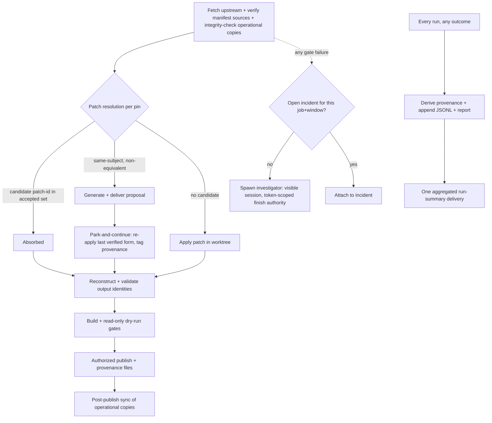

# Fork-Integration Release System Overhaul - Plan

## Goal Capsule

- **Objective:** The nightly integration job keeps `fork-integration` rebased on fast-moving upstream without manual surgery: upstream history rewrites are detected and resolved through human-approved reconciliation proposals while releases keep flowing, every carried change has queryable provenance (merged, absorbed, superseded, private, PR-open), failures and run progress are loudly visible, and the system itself is versioned in this repo with a defined sync boundary to the operational copies.
- **Authority hierarchy:** explicit current user instruction → current fetched remote and published branch identity → pinned foundation metadata and stable patch-ids → complete published commit range → manifest invariants → historical docs after freshness checks. (From the 2026-08-13 failure review; the twelve documented failures were authority failures, not git failures.)
- **Execution profile:** fail-closed throughout, and every gate that refuses also delivers its refusal visibly. No weakening of validators, leases, or restore-on-failure contracts. Privileged actions (push, publish) are gated by verifiable code-path checks, never by prompt text alone.
- **Stop conditions:** never push, publish, or run the live release without explicit user authorization; never mutate manifest semantics beyond what a unit specifies; never edit the operational copies at `%HERMES_HOME%\scripts\` outside the U2 sync entry points; stop and surface if any settled decision proves infeasible.
- **Tail ownership:** implementation ends at green tests + the U11 witnessed canary. The real publish and the installed-app update proof remain user-owned gates.

---

## Product Contract

### Summary

Evolve the existing release job (script + manifest + investigator) in place: version it in-repo with a publish-synced deployment boundary, generalize today's absorption fix into a churn-reconciliation proposal flow that never halts release continuity, derive per-change provenance from ground truth, and implement the already-specified live-output and investigator-finishes-release design from Hermes session `20260815_114550_5d9910` with code-enforced authority.

### Problem Frame

Upstream rewrites history continuously — the same logical commit (#63047 journal fix) has existed under at least three SHAs with three patch-ids, and each rewrite strands the manifest's pins until a human performs manifest surgery. The fork's carried changes span private fixes, open upstream PRs (#84778), and changes upstream absorbed in modified form; nothing records which state each change is in. The system that manages all this lives outside git at `%HERMES_HOME%\scripts\`, has been live-edited out-of-band (a 115-byte unattributed edit on 2026-08-15 12:38), and fails silently: a scheduler restart mid-run leaves `unknown` status with no delivery and a stale-green `last_status` for hours, while investigator sessions get "admitted" and are never seen again. Three update-emergency snapshots landed on 2026-08-15 alone.

### Requirements

**Churn resilience**
- R1. When upstream carries a same-subject, non-patch-equivalent rewrite of a pinned patch, the run generates a reconciliation proposal (evidence: candidate SHA, stable patch-ids, full candidate diff, interdiff summary) and delivers it, instead of failing with only a log line. Candidate eligibility is constrained: exact subject-line equality (not substring, not message-body matches), the candidate must be an ancestor of the upstream tip fetched in that run, `Revert "`-prefixed subjects are excluded, and author/committer plus signature state are recorded in the proposal.
- R2. A proposal is applied only after human approval; approval re-verifies the candidate is still upstream's current form and auto-invalidates and regenerates on mismatch. Approval is attributable (approver identity, wall-clock timestamp, candidate SHA + patch-id recorded in the artifact and the manifest edit's commit message), arrives through a channel the investigator agent cannot drive, and is explicitly on the investigator's forbidden list.
- R3. A rejected or superseded candidate's patch-id is recorded (blocklist) so it is never silently re-proposed or re-accepted; approved absorptions append the superseded ids automatically.
- R4. Absorption is recorded through the existing accepted-patch-identity mechanism (`accepted_output_patch_ids` / `reviewed_replacement`), extended — never a parallel mechanism.
- R19. A pending proposal does not stop releases: the run re-applies the parked pin's last verified form and completes, tagging output provenance `pin-parked-pending-proposal:<id>`; a full abort happens only when the last-good form fails to apply. Upstream churn alone never skips a nightly.

**Provenance**
- R5. Every carried change has a ledger entry with a state from a single vocabulary: `private-only`, `pr-open`, `absorbed-verbatim`, `absorbed-modified`, `superseded`, plus the existing `excluded_until_*` reason codes.
- R6. The operator can query "did change X get merged upstream, and in what form?" and get an evidence-backed answer (SHAs, patch-ids, PR state) — including for changes not touched in months; no retention mechanism may drop a lineage's current state.
- R7. Provenance is derived from ground truth (manifest + git ancestry/patch identity + PR status) on every run, regardless of gate outcome; divergence from the previous derivation is delivered loudly. Provenance reporting is not a release gate (KTD7).

**Loud failures and live progress**
- R8. An execution reclassified `unknown` produces a delivery, classified "unconfirmed" (not "failed"), and `jobs.json` `last_status` is corrected synchronously in the same reap pass.
- R9. An orphaned run that later completes has its real outcome recorded (sibling late-outcome record; the `unknown` audit row is never overwritten) and delivered instead of being discarded by the terminal-state guard.
- R10. The run streams per-stage progress (NDJSON) into its cron session as one in-place-updated surface, visible in the Desktop cron run view; the job stays `no_agent`. Streamed lines are redacted before reaching any surface; the final delivered brief and the wake-gate parser see only the final result line plus a stage summary, byte-compatible with today's consumers.
- R11. Investigator sessions are visible in the session sidebar (keyed on the investigator's own identity, never on the `cron_session` marker — nightly run sessions stay out of recents), carry the cron run id, and incidents have closure states with a liveness heartbeat; at most one active finisher per job per authority window, with an `abandoned`-and-replace path when a finisher dies.
- R12. The investigator may finish the day's release under a scoped authority window (force-with-lease push, prerelease publish, checksum verify); installer execution, cron mutation, credentials, gateway restarts, and proposal approval stay forbidden.
- R20. Investigator authority is enforced by the push/publish code path, not by goal text: a spawner-minted, expiring authority token is required and validated at the privileged actions; forged, expired, or absent tokens are refused in code. (Known limit, stated honestly: ambient same-user git/gh credentials mean file-based controls bound accidents and drift, not a fully hostile in-context agent; the operational note records the branch-protection follow-up.)
- R13. One witnessed end-to-end proof exists: a forced failure produces the delivery, the visible investigator session, and a finished (canary) release path.
- R18. A dead-man's switch: an out-of-process check delivers "nightly integration job overdue by N" when the job misses its window, and a positive daily heartbeat delivery on green runs makes silence itself an alarm. Steady-state delivery volume is bounded: one aggregated run-summary delivery per run, per-class deliver-on-transition semantics, explicit escalation when a condition persists unchanged.

**System versioning and integrity**
- R14. The release script, investigator, and manifest live in this repo, tested in CI; operational copies update only through the U2 sync entry points, are verified against the published git tree's blob hashes (the stamp is a pointer, not the authority), and out-of-band edits are detected even when the stamp was rewritten consistently.
- R15. Exactly one actor can hold the integration run at a time via the release script's existing exclusive lock, extended with holder identity and stale reclaim; a blocked entrant gets an explicit "busy, held by X since T" refusal.
- R16. Verified-current defect posture: characterization tests pin the current operational script's behavior on the three 2026-08-13 audit items (foundation re-verification in output, post-push recovery wiring, dry-run ref hygiene) — which the 2026-08-15 script largely fixed — and the surviving residuals are closed: `_validate_required_records` recomputes output patch identity from the reconstructed tree instead of trusting the recorded value, and dead recovery code paths are wired or deleted.
- R17. `docs/solution-fork-upstream-canonicalization.md` is corrected to the pinned-unmerged-foundation policy actually in force, and gains the run-lifecycle/loud-failure doctrine this plan creates.

### Scope Boundaries

- The updater transport itself is settled and untouched (follow upstream's script path; decided 2026-08-15).
- The explicit-update force-kill change and the installed-app update canary are separate tracked tasks; this plan unblocks them but does not contain them.
- No adoption of external fork-management platforms; no second integration branch; no flip of the job to agent-driven (`no_agent` stays, settled in session `20260815_114550_5d9910`).
- Desktop sidebar work is limited to investigator-session visibility, not a cron UX redesign; `source="cron"` run sessions keep their existing out-of-recents invariant.

**Deferred to Follow-Up Work**
- Upstreaming the generic live `no_agent` progress mechanism as a PR to NousResearch/main (split identified in the handoff spec).
- Stale safety-branch and worktree cleanup policy (object retention for proposal evidence is NOT deferred — U6 owns keep-refs).
- Automated PR-status webhooks (this plan polls best-effort via `gh`).
- GitHub branch protection for `origin/fork-integration` (force-push restriction / push allowlist) — the only enforcement point outside this host; operational note, user-owned.

### Sources

- Hermes session `20260815_114550_5d9910` and its spec: `%HERMES_HOME%\review-artifacts\fork-integration-history\handoff-no-agent-live-output-and-failure-finish.md` — the authoritative design for R10–R12.
- `%HERMES_HOME%\review-artifacts\fork-integration-history\fork-integration-skill-review.html` (2026-08-13) — twelve failure patterns, authority hierarchy, proof ladder, the original three-defect audit behind R16, and the doctrine conflict (R17).
- `docs/solution-fork-upstream-canonicalization.md` — doctrine: patch-identity rule, `{source, subject, reason, resolution}` record shape, `excluded_until_*` vocabulary, safety-ref pattern, dry-run-is-not-proof.
- 2026-08-15 forensics and reconciliation (this session): the #63047 three-SHA churn chain and the accepted-patch-id fix that R1–R4 generalize; five-persona plan review (34 findings folded into this revision).

---

## Planning Contract

### Key Technical Decisions

Rejected architecture alternatives, recorded once: a rebased patch-stack with rerere (upstream absorption falls out as empty commits) was not chosen because the manifest-pin model is what the fail-closed release doctrine, per-change provenance, and the published-commit-preservation validators are already built around; the do-nothing baseline loses to the documented weekly toll of manual manifest surgery and silent failures.

- KTD1. **In-repo home is `scripts/fork_integration/`** (underscore — importable by pytest; a hyphenated path cannot be a Python module), mirroring the `scripts/desktop-update/` multi-file operational-subsystem pattern; never `scripts/release.py`, which is an existing unrelated changelog tool. (session-settled: user-approved — chosen over leaving the system at `%HERMES_HOME%`: versioning/review ends out-of-band drift.)
- KTD2. **Sync boundary: operational copies update through exactly two attributable entry points** — (a) automatic sync immediately after a successful publish of the exact `fork-integration` SHA containing them, and (b) a provisional/break-glass deploy (`sync.py deploy --from-sha <committed SHA> --reason <text>`) for an in-window investigator or an authorized operator when the publish path itself is broken, stamped `provisional: true` and re-stamped by the next successful publish. Never mid-run, never on tick, never a direct edit. Integrity: operational files are verified against the published (or provisionally deployed) git tree's blob hashes via the repo clone; the embedded stamp only names which SHA to check, so a consistently rewritten file+stamp still fails. Sync is staged (temp sibling dir, hash-verified, per-file `os.replace`, stamp written last as the commit point) under an exclusion covering the scripts directory. A mismatch at run start permits exactly one action — re-sync from a verified SHA — never a bypass flag.
- KTD3. **Reconciliation proposals are a state machine** — `generated → pending-approval → approved | rejected | stale-invalidated → applied` — stored as hash-stamped pending-proposal artifacts under `%HERMES_HOME%\review-artifacts\fork-integration-proposals\`, delivered on generation, re-verified at approval (R2), with rejections appending to the per-foundation blocklist (R3). Approval never applies the stored fragment: it re-derives the manifest edit from the freshly re-verified candidate and requires byte-equality with the stored fragment, else `stale-invalidated`. Livelock guard: approval may target the lineage (subject + file-set policy) rather than a single SHA, and after 3 stale-invalidations the delivery escalates to `churn-livelock` with an approve-latest-at-run-time option. (session-settled: user-approved — chosen over fully-automatic absorption: fail-closed stays; and over status-quo manual surgery: that is the toil being removed.)
- KTD4. **Provenance is derived on demand; persistence is an append-only JSONL history plus a generated markdown report** — no database in v1. Each run appends one derivation record; the report renders current state from live derivation. Nothing ever prunes a lineage's current state (R6). Two reviewers independently converged on this over the earlier SQLite/WAL/retention shape, whose pruning semantics exist for a high-frequency concurrent event stream this is not; a database returns only if a concrete query need appears that JSONL + derivation cannot serve.
- KTD5. **Investigator authority window = min(next scheduled fire of the job, spawn + 4h hard cap)**, computed from a monotonic timestamp captured at spawn and frozen into the authority record; an absent or unresolvable next fire means immediate expiry, and a schedule edit after spawn cannot extend a live window. The investigator re-checks remaining authority immediately before each privileged action. One active finisher per job per window; a second failure in-window attaches to the open incident. Incident records gain `session_id`, timestamps, a liveness heartbeat, and closure transitions (`resolved`, `expired`, `abandoned`, `superseded`).
- KTD6. **`unknown` is delivered as "unconfirmed", not "failed"**, and the investigator's first mandated step is orphan-evidence collection (origin tip, worktree HEAD, lock state) before any fix or re-run — an orphan may already be mid-publish. A completion arriving after `unknown` writes a sibling late-outcome record (new `execution_late_outcomes` table; the `executions` row and its CHECK constraint are untouched) and triggers delivery (R9).
- KTD7. **The report informs; the manifest gates.** Provenance divergence is delivered loudly but does not block a release — the manifest validators remain the sole enforcement layer. Chosen over the fail-closed-ledger alternative to avoid a second, derivable gate whose own bugs could brick the nightly; enforcement stays where the doctrine already puts it.
- KTD8. **Live progress uses the handoff spec's mechanism with verified scheduler mechanics**: flushed per-stage NDJSON on stdout (final JSON result line preserved and byte-compatible for existing consumers); `_run_job_script` gains an optional `on_line` callback backed by per-pipe `readline` reader threads that preserve the existing deadline/cancel/terminate/drain semantics (Windows `communicate()` cannot yield partial output); only `run_job`'s no_agent branch passes the callback, leaving monitor and prerun callers unchanged. Each streamed line passes through `agent.redact.redact_sensitive_text` (fail-closed `[REDACTED - redaction failed]`, partial-line buffering) before reaching the session; the release script keeps its own `redact_process_output` for the file log. The progress surface is one in-place-updated assistant message via a new `SessionDB.update_message`, and `_record_run` finalizes into that message instead of appending a second assistant row. Default-on for long `no_agent` jobs. (session-settled: user-directed in session `20260815_114550_5d9910` — chosen over flipping the job to agent-driven: script-only stays.)
- KTD9. **Run mutual exclusion extends the release script's existing `exclusive_lock()` / `LOCK_PATH`** with holder identity (holder, pid, started-at) and a stale-reclaim rule (dead pid + age, reclaim logged), acquired by all three entry points (scheduler run, investigator, manual run) with an explicit busy refusal (R15). No second lock layer; `--force-with-lease` remains the separate ref-level guard at push time; `--dry-run` keeps skipping the lock and is genuinely read-only.
- KTD10. **Doctrine doc correction encodes the pinned-unmerged-foundation policy** (approved PR head on current upstream regardless of merge state) and drops volatile SHAs/PR lists from durable prose in favor of derive-live references. (session-settled: user-directed — the #82832 correction is the user's own recorded instruction; chosen over reverting automation to merge-gating.)
- KTD11. **Ticker/PID concurrency is diagnosed before any new ownership machinery is built.** A per-profile non-blocking tick lock already exists (`cron/.tick.lock`); the 15-owner-PID observation is either a lock defect (fix it) or legitimate CAS-protected claim behavior (document it). No redundant lock layer without that answer.
- KTD12. **Privileged-action authority is a spawner-minted token, validated in code.** The investigator spawner (a non-agent process) mints an authority record (job id, incident signature, session id, frozen expiry, allowed action set) at spawn; `release.py`'s push and publish paths require and validate it and refuse forged, expired, or absent tokens. Goal text describes the contract; the code path enforces it (R20).
- KTD13. **Churn never stops the line: park-and-continue.** Proposal generation parks the pin logically but the run continues with the pin's last verified form and tags provenance; only a failed re-apply of the last-good form aborts (R19).
- KTD14. **One aggregated run-summary delivery per run.** All delivery classes (proposal, divergence, unconfirmed, late-outcome, out-of-band, overdue) aggregate into a single per-run summary with deliver-on-transition semantics and an explicit escalation for conditions unchanged N runs; the dead-man's overdue check is the only out-of-process sender (R18).

### High-Level Technical Design

Nightly run pipeline with the new branches (proposal with park-and-continue, absorption, loud-failure paths, every-run provenance):



Reconciliation proposal lifecycle (KTD3):

```mermaid
stateDiagram-v2
  [*] --> generated: same-subject non-equivalent detected
  generated --> pending_approval: hash-stamped artifact written + delivered
  pending_approval --> approved: attributable human approval; candidate re-verified current; edit re-derived and byte-equal
  pending_approval --> stale_invalidated: upstream rewrote again / re-verify or byte-equality fails
  pending_approval --> rejected: human rejects
  stale_invalidated --> generated: regenerate with fresh evidence (3 strikes → churn-livelock escalation)
  rejected --> [*]: candidate patch-id appended to blocklist
  approved --> applied: manifest edit committed to fork-integration; operational manifest re-stamped
  applied --> [*]: next run absorbs; provenance records absorbed-modified
```

### Sequencing

U1 → U2 establish the versioned system and sync boundary first so every later change lands through review. U3–U5 harden run-lifecycle integrity and verify the defect posture before new features depend on them. U6–U7 build churn proposals and provenance on the hardened base (U5's read-only dry-run verification precedes U6 so proposal generation can run under a genuinely read-only dry-run). U8–U9 implement the handoff spec with the token gate. U10–U11 correct doctrine and prove the whole loop.

---

## Implementation Units

| U-ID | Title | Key files | Depends on |
|---|---|---|---|
| U1 | Import the release system into the repo + CI | `scripts/fork_integration/*`, `scripts/tests/`, `.github/workflows/` | — |
| U2 | Sync boundary: publish-gated + provisional, tree-verified, atomic | `scripts/fork_integration/sync.py`, `release.py` | U1 |
| U3 | Run-lifecycle integrity: lock identity, orphan truth, status honesty | `scripts/fork_integration/release.py`, `cron/executions.py` | U1 |
| U4 | Unknown/late-outcome delivery + dead-man's switch + aggregation | `cron/executions.py`, `cron/scheduler.py`, `agent/monitoring/cron_health.py` | U3 |
| U5 | Characterize and close the residual release-script defects | `scripts/fork_integration/release.py` | U1 |
| U6 | Reconciliation proposals: state machine, park-and-continue, keep-refs | `scripts/fork_integration/proposals.py`, `release.py` | U2, U5 |
| U7 | Provenance derivation, JSONL history, report, retirement proposals | `scripts/fork_integration/ledger.py` | U2, U6 |
| U8 | Live NDJSON progress: script + scheduler + Desktop view | `scripts/fork_integration/release.py`, `cron/scheduler.py`, `hermes_state.py`, `apps/desktop/src/app/cron/` | U1 |
| U9 | Investigator: token authority, incidents + heartbeat, visibility | `scripts/fork_integration/investigator.py`, `release.py`, `tui_gateway/methods_session.py`, `apps/desktop/src/app/chat/sidebar/` | U3, U8 |
| U10 | Doctrine correction | `docs/solution-fork-upstream-canonicalization.md` | U2, U3, U6, U9 |
| U11 | Witnessed end-to-end proof + toil metric | `scripts/fork_integration/`, canary assets | U4, U7, U9, U10 |

### U1. Import the release system into the repo + CI

- **Goal:** The operational system is versioned: `scripts/fork_integration/` holds the release script, investigator, manifest, and a README stating the sync contract; CI exercises them. The unattributed operational delta is characterized before it becomes canonical.
- **Requirements:** R14, R16 (enables).
- **Dependencies:** none.
- **Files:** `scripts/fork_integration/release.py` (imported from the operational `hermes-integration-release-windows.py`), `scripts/fork_integration/investigator.py`, `scripts/fork_integration/manifest.json`, `scripts/fork_integration/README.md`, `scripts/tests/test-fork-integration-release.ps1`, `tests/cron/test_fork_integration_release.py`, `.github/workflows/installer-tests.yml` (new job) or a sibling workflow.
- **Approach:**
  1. Pre-import reconciliation: diff the operational copies against the newest available backups and the 2026-08-15 12:38 mtime boundary; identify the ~115-byte delta; record it in the import commit message as accepted-with-rationale or reverted. Fail the unit if the delta cannot be explained.
  2. Byte-import with an import-provenance note (source path, mtime, sha256) in the commit message; no behavior change in this unit.
  3. Split pure functions (patch identity, manifest load/validate, resolution) into importable module structure only as far as testing requires — no rewrite. Tests import `scripts.fork_integration.*` directly (underscore path, KTD1).
  4. Contract test per the `scripts/tests/test-desktop-update-handoff.ps1` pattern: temp fake install, `--dry-run` invocation, assert gate outputs; pytest covers manifest loader invariants and `patch_resolution` absorption/raise branches using the repo's `SimpleNamespace` subprocess-mock idiom.
  5. New CI job modeled on the `installer-tests.yml` `powershell` job.
- **Patterns to follow:** `scripts/desktop-update/` layout; `scripts/ci/*.py` standalone-script convention; naming distinct from `scripts/release.py` and from `hermes_cli/update_cmd.py`'s fork-sync vocabulary.
- **Test scenarios:**
  - Manifest loader accepts the current live manifest verbatim (golden file) and rejects: replacement id not in accepted set; replacement pair not declared as component patch; malformed patch-id.
  - `patch_resolution` marks a pin absorbed when a candidate's stable patch-id is in the accepted set; raises same-subject when candidates exist, replacement absent; parks to apply-path when replacement present but no candidate matches.
  - `stable_patch_id` returns the known-good id for a fixture commit (derived from a real repo fixture, not hand-written).
  - PowerShell contract test runs the script `--dry-run` against a fake install and exits 0 with the expected JSON keys.
- **Verification:** CI green on the new job; `py_compile` on all imported modules; contract test passes under pwsh and Windows PowerShell; the import commit message explains the 12:38 delta.

### U2. Sync boundary: publish-gated + provisional, tree-verified, atomic

- **Goal:** Operational copies change only via the two KTD2 entry points, verified against the git tree, atomically, with the tracked file set enumerated; out-of-band edits are detected even with a rewritten stamp (R14).
- **Requirements:** R14.
- **Dependencies:** U1.
- **Files:** `scripts/fork_integration/sync.py`, `scripts/fork_integration/release.py` (post-publish hook + run-start integrity check), `tests/cron/test_fork_integration_sync.py`.
- **Approach:**
  1. Enumerate the tracked file set explicitly in `sync.py` (release.py, investigator.py, sync.py, manifest.json, plus named helpers); the canary manifest path (U11) is outside it.
  2. Post-publish sync: stage the set to a temp sibling directory, verify each file's blob hash against the published tree via the repo clone, commit with per-file `os.replace`, stamp written last; failure discards staging and leaves the prior generation intact. Exclusion held over the scripts directory during the swap.
  3. Provisional/break-glass deploy: `sync.py deploy --from-sha <committed fork-integration SHA> --reason <text>` — same staged mechanics from an unpublished-but-committed SHA, stamp carries `provisional: true` + reason + actor; the next successful publish re-stamps. Recorded in the JSONL history as `break-glass`.
  4. Run-start integrity check: resolve the stamped SHA, read expected blob hashes from the git tree, compare files; a stamp naming an unreachable SHA or any hash mismatch fails closed. The mismatch state permits exactly one action — re-sync via the entry points above — never a bypass assertion.
  5. Manifest approval path (with U6): approvals commit to `fork-integration` and re-stamp the operational manifest in place via a named `sync.py restamp-manifest --approved-fragment <hash>` step, so an approval is neither invisible nor an out-of-band edit.
- **Execution note:** land the sync-boundary canary before enabling enforcement — commit a trivial marker change on a branch and prove it does not reach the operational copy until publish/deploy, then reaches it exactly once.
- **Test scenarios:**
  - Sync copies exactly the tracked file set and writes stamps; re-running sync for the same SHA is idempotent.
  - A file and its stamp edited consistently still fail the run-start check (tree is authoritative).
  - A run claiming any repair status cannot execute the release path with mismatched files; the only permitted action is re-sync.
  - An interrupted sync (kill between file writes) leaves the prior generation complete and stamp-consistent.
  - Provisional deploy stamps `provisional: true` and the next publish re-stamps.
  - Sync never fires on a failed or dry-run publish.
  - An approved manifest fragment re-stamp is accepted; any other manifest delta still fails closed.
- **Verification:** canary sequence witnessed and recorded (before/after mtimes + stamps); tests green.

### U3. Run-lifecycle integrity: lock identity, orphan truth, status honesty

- **Goal:** One owner of "is this job running and where": the existing exclusive lock gains holder identity and stale reclaim; orphan evidence protocol; `last_status` honesty; late-outcome schema; ticker root-cause (KTD5/6/9/11; R8 partial, R9, R15).
- **Requirements:** R8, R9, R15.
- **Dependencies:** U1.
- **Files:** `scripts/fork_integration/release.py` (extend `exclusive_lock()`/`LOCK_PATH` with holder/pid/started-at + stale reclaim; orphan evidence emitter), `cron/executions.py` (sibling `execution_late_outcomes` table + late-outcome path), `tests/cron/test_execution_ledger.py` (extend), `tests/cron/test_fork_integration_lock.py`.
- **Approach:**
  1. Extend the existing release lock (KTD9): holder, pid, started-at recorded in the lock; busy → explicit refusal naming holder and age; stale lock (dead pid + age) reclaimable with the reclaim logged. Investigator and manual entry points acquire the same lock. No second lease.
  2. Late outcomes (KTD6): new `execution_late_outcomes` table (execution_id, observed_at, success, error, delivery_outcome), `CREATE TABLE IF NOT EXISTS`, no migration of existing rows; `finish_execution` on a terminal row writes a late-outcome record instead of a silent no-op.
  3. `recover_interrupted_executions` synchronously corrects `jobs.json` `last_status` in the same reap pass (R8 half; delivery itself is U4).
  4. Diagnose the 15-owner-PID observation against the existing `.tick.lock`: reproduce or refute a lock bypass; fix the defect if real, else document the claim-concurrency behavior in the README. If a real lock defect is found, revisit KTD9's sufficiency before U9. No new ticker machinery without a proven defect (KTD11).
- **Test scenarios:**
  - Second entrant during a held lock gets the busy refusal with holder identity; no worktree mutation occurs.
  - Dead-pid stale lock is reclaimed and the reclaim is recorded.
  - Completion after `unknown` writes a late-outcome row and does not modify the `unknown` audit row.
  - Reap pass leaves `jobs.json.last_status` reflecting the reaped run, not the prior day's `ok`.
  - The late-outcomes table is created on first use against an existing production-shaped `executions.db`.
- **Verification:** targeted pytest green; a manual double-invocation demonstrates the busy refusal end-to-end.

### U4. Unknown/late-outcome delivery + dead-man's switch + aggregation

- **Goal:** Reaped-`unknown` and late-outcome events produce "unconfirmed"/"late outcome" deliveries; a job that never runs raises an out-of-process overdue alarm; total delivery volume is bounded by aggregation (KTD6/14, R8, R9, R18).
- **Requirements:** R8, R9, R18.
- **Dependencies:** U3.
- **Files:** `cron/executions.py` (new `recover_interrupted_executions_detailed() -> list[dict]`; the existing `-> int` function and the `recover_interrupted()` provider protocol stay untouched), `cron/scheduler.py` (reap site calls the detailed variant, delivers via the `_maybe_mirror_cron_delivery` / `_get_home_target_chat_id` machinery, then emits telemetry once with resolved `delivery_outcome`), `agent/monitoring/cron_health.py`, dead-man's assets (Windows scheduled task definition + check script under `scripts/fork_integration/`), `tests/cron/test_cron_relay_delivery_guards.py` (extend), `tests/monitoring/test_cron_health_export.py` (extend).
- **Approach:** one delivery per recovered record, classified "unconfirmed" with the orphan-evidence pointer; the telemetry emit is deferred until delivery outcome is known so exactly one projection event fires per execution. Dead-man's switch: an out-of-process overdue check (scheduled task invoking a small checker) delivers when `now - next_run_at` exceeds the grace window; green runs send a daily heartbeat line inside the aggregated run summary (KTD14). Aggregation: all classes fold into one run-summary delivery with deliver-on-transition semantics and an unchanged-for-N-runs escalation.
- **Test scenarios:**
  - Reaped record with configured `deliver` target → exactly one delivery and exactly one telemetry event with `delivery_outcome=delivered`.
  - No delivery target configured → `not_configured`, no raise.
  - Delivery transport failure → `failed`, reap still completes (never blocks the tick).
  - Double reap of the same execution does not double-deliver.
  - Provider protocol consumers still see the unchanged `-> int` signature (compile/protocol test).
  - Overdue check fires when `next_run_at` is stale and the scheduler is dead; does not fire during a healthy long run.
  - A persisting condition delivers on transition and re-delivers only via the N-run escalation.
- **Verification:** extended suites green; one live forced reap (kill a canary job's owner) shows the aggregated Discord delivery.

### U5. Characterize and close the residual release-script defects

- **Goal:** Pin current behavior of the three 2026-08-13 audit items with characterization tests (the 2026-08-15 script largely fixed them), then close the verified residuals (R16).
- **Requirements:** R16.
- **Dependencies:** U1.
- **Files:** `scripts/fork_integration/release.py`, `tests/cron/test_fork_integration_release.py` (extend).
- **Approach:** characterization-first on: foundation re-verification against the reconstructed head (`validate_required_foundations(..., records=...)` call in `main()`), post-push recovery (`restore_pre_push_checkout` in the exception handler with the `branch_pushed` guard), and dry-run ref hygiene (`inspect_dry_run` via `remote_ref_head`/`ls-remote`). Then close residuals: `_validate_required_records` recomputes `_commit_patch_id(output_commit)` from the reconstructed tree instead of trusting the record's stored `output_patch_id`; `has_integration_release` is wired into the recovery path or deleted. If characterization proves any audit item still live, fix it here.
- **Execution note:** characterization tests precede every change; this is live-operational legacy code.
- **Test scenarios:**
  - Characterization: each of the three audit behaviors pinned as currently implemented.
  - Reconstructed output missing a foundation's patch identity fails validation even when the record's stored id claims otherwise (recompute path).
  - Simulated post-push release failure invokes the recovery helper (spy) and reports its outcome.
  - `--dry-run` leaves every `refs/` unchanged (snapshot before/after) while still producing the inspection report.
- **Verification:** characterization + new tests green; a real `--dry-run` against the live worktree shows zero ref movement.

### U6. Reconciliation proposals: state machine, park-and-continue, keep-refs

- **Goal:** Same-subject churn produces an evidence-backed, tamper-resistant proposal lifecycle while releases keep flowing (KTD3/13; R1–R4, R19).
- **Requirements:** R1, R2, R3, R4, R19.
- **Dependencies:** U2, U5.
- **Files:** `scripts/fork_integration/proposals.py`, `scripts/fork_integration/release.py`, `tests/cron/test_fork_integration_proposals.py`.
- **Approach:**
  1. Detection contract (R1): exact subject-line equality against subjects only; `Revert "`-prefixed subjects excluded; candidate must be an ancestor of the upstream tip fetched this run; author/committer + signature state recorded. Secondary detector for renamed re-lands: changed-file-set overlap + diff similarity above a threshold, marked `low-confidence-match`.
  2. On detection: write a hash-stamped proposal artifact (source pin, candidates with stable patch-ids, full candidate diff, interdiff summary, recommended manifest edit as a ready-to-apply JSON fragment, artifact sha256 in the delivered message), state `generated→pending-approval`, deliver via the run summary; then park-and-continue (KTD13): re-apply the pin's last verified form, tag provenance `pin-parked-pending-proposal:<id>`, complete the release; abort only if the last-good form fails to apply.
  3. Keep-refs: on every manifest pin change, write `refs/pinned/<component>/<patch-id>` for the outgoing commit; the proposal writer fails closed with `evidence-unavailable` when either side of an interdiff cannot be resolved.
  4. Approval (`proposals.py approve <id> --artifact-hash <sha256>`): interactive-channel only (refuses non-interactive/agent invocation; approval is on the investigator's forbidden list per R2/R12); re-verifies the candidate is still current; re-derives the manifest edit and requires byte-equality with the stored fragment; on match, commits the manifest edit to `fork-integration` with approver identity + candidate SHA + patch-id in the message, appends superseded ids to the blocklist, and re-stamps the operational manifest via `sync.py restamp-manifest`; on mismatch, `stale-invalidated` → regenerate. Lineage-level approval (subject + file-set) supported; 3 stale-invalidations escalate `churn-livelock`.
  5. Reject appends the candidate patch-id + human reason to the blocklist; blocklisted candidates never count as `equivalent` and are never re-proposed.
- **Test scenarios:**
  - Churned pin generates exactly one pending proposal; a second run with the same candidate does not duplicate it; the run still completes (park-and-continue) with tagged provenance.
  - A same-subject commit that is not an ancestor of tracked upstream produces no proposal; an upstream `Revert "…"` produces no proposal; a retitled re-land is caught by the file-set/similarity detector with the low-confidence marker.
  - Approval with a still-current candidate and matching byte-equality mutates the manifest exactly as loader invariants require (reuse U1 golden loader tests), commits to the branch, re-stamps, and records approver identity.
  - A tampered artifact (fragment edited after generation) fails byte-equality → `stale-invalidated`, no manifest change.
  - Approval after upstream rewrote again → `stale-invalidated`, regenerated with fresh evidence; the third strike delivers `churn-livelock`.
  - Non-interactive/agent-driven approve invocation is refused.
  - Rejected candidate's patch-id never matches as equivalent in later resolutions.
  - The full #63047 three-SHA churn history, replayed as fixtures, resolves with one approval, no manual manifest edit, and no skipped release. A context-drift fixture (byte-identical change, shifted context lines, changed patch-id) exercises the lineage-approval path.
  - Keep-ref exists for the outgoing commit after an approved absorption; a proposal whose interdiff side is unresolvable fails closed `evidence-unavailable`.
- **Verification:** the replayed-churn fixture test is the acceptance proof; loader invariants green after every generated edit.

### U7. Provenance derivation, JSONL history, report, retirement proposals

- **Goal:** Queryable per-change provenance derived from ground truth on every run, with append-only history and manifest shrinkage (KTD4/7; R5–R7).
- **Requirements:** R5, R6, R7.
- **Dependencies:** U2, U6.
- **Files:** `scripts/fork_integration/ledger.py`, `tests/cron/test_fork_integration_ledger.py`.
- **Approach:** derive state on demand per carried change (manifest + `git cherry`/patch-id ancestry + best-effort `gh pr view`, rate-conscious, degrading to `unknown-offline` without failing the run); append one derivation record per run to a JSONL history at `%HERMES_HOME%` (never pruned by lineage); `ledger.py report` renders the operator-facing markdown answer with evidence (SHAs, patch-ids, PR state); divergence from the prior derivation is folded into the run-summary delivery (KTD7: inform, don't gate). PR/report text is treated as untrusted display data. Retirement: a pin whose state is `absorbed-verbatim` for 3 consecutive runs and whose change is an ancestor of upstream/main generates a retire-pin proposal through the U6 state machine (human-approved, blocklist-recorded), so the manifest shrinks by the same mechanism it grows.
- **Test scenarios:**
  - Each R5 state is produced by a corresponding fixture (private-only, open-PR, absorbed-verbatim, absorbed-modified via reviewed replacement, superseded via blocklist, excluded via reason code).
  - `gh` unavailable → PR states degrade to `unknown-offline` without failing the run.
  - Report names evidence for every state claim, including a change untouched for months (history never drops its lineage).
  - A divergence between consecutive derivations lands in the run summary exactly once (transition semantics).
  - Three consecutive absorbed-verbatim derivations + ancestry → exactly one retire-pin proposal; approval removes the pin and loader invariants stay green.
- **Verification:** report for the current live manifest matches the known truth of this week's history (journal fix = absorbed-modified; #84778 = pr-open).

### U8. Live NDJSON progress: script + scheduler + Desktop view

- **Goal:** Implement the handoff spec's Part A with verified mechanics (KTD8, R10): per-stage NDJSON, one in-place-updated redacted progress surface, clean delivery separation, Desktop cron run view shows growing stages.
- **Requirements:** R10.
- **Dependencies:** U1.
- **Files:** `scripts/fork_integration/release.py` (stage emitter), `cron/scheduler.py` (`_run_job_script` optional `on_line` callback + reader threads; `run_job` no_agent branch passes it; stage/final-line separation for doc, delivery, and `_parse_wake_gate`), `hermes_state.py` (`SessionDB.update_message`), `apps/desktop/src/app/cron/index.tsx` + tests, `tests/cron/test_cron_no_agent.py` (extend).
- **Approach:** per KTD8: flushed NDJSON `{ts, stage, ok, detail}` alongside the file log, final JSON result line unchanged; `on_line` callback with per-pipe `readline` reader threads preserving deadline/cancel/terminate/drain semantics — monitor and prerun callers keep the `communicate()` path; per-line `agent.redact.redact_sensitive_text` with fail-closed fallback and partial-line buffering before anything reaches the session; the scheduler splits stage lines (objects carrying a `stage` key) from the final result line — delivery, run doc, and `_parse_wake_gate` receive only the final line plus a stage summary; one in-place-updated assistant message via `SessionDB.update_message`, with `_record_run` finalizing into it (fallback append when live progress never started); default-on for long `no_agent` jobs; the path must not import `AIAgent`/`run_agent`.
- **Execution note:** TDD-first per the handoff — the three RED tests (no mid-run session content today; `log()` not flushed to stdout; goal text still forbids finishing) precede the change; prove the UI with the spec's disposable sleep-canary `no_agent` script.
- **Test scenarios:**
  - Mid-run, the cron session contains exactly one assistant progress surface whose content grows; `_record_run` finalizes it in place — never a second assistant message (role-alternation test).
  - The delivered payload for a stage-emitting run is byte-identical to the pre-change brief (golden final-line test); `_parse_wake_gate` sees the final result line even when the run aborts between a stage line and the final line.
  - A synthetic secret emitted mid-run never appears in the in-progress message (including one split across two read chunks).
  - Monitor and prerun script callers are byte-for-byte unaffected (no callback, `communicate()` path).
  - Deadline, cancel-event, and terminate/drain behavior are preserved under the reader-thread path.
  - Desktop run view renders growing stage lines for an `is_active` run (component test).
- **Verification:** the sleep-canary shows live growing stages in the real Desktop cron view; existing no_agent suites stay green.

### U9. Investigator: token authority, incidents + heartbeat, visibility

- **Goal:** Implement the handoff spec's Part B with code-enforced authority and incident integrity (KTD5/6/12; R11, R12, R20).
- **Requirements:** R11, R12, R20.
- **Dependencies:** U3, U8.
- **Files:** `scripts/fork_integration/investigator.py` (spawner mints the authority token; goal contract; incident schema + heartbeat; orphan-evidence first step), `scripts/fork_integration/release.py` (push/publish paths validate the token), `tui_gateway/methods_session.py` + `apps/desktop/src/app/chat/sidebar/` (visibility trace + fix), `tests/cron/test_fork_integration_investigator.py`.
- **Approach:**
  1. Authority token (KTD12): minted by the spawner at spawn — job id, incident signature, session id, frozen expiry per KTD5's `min(next fire, spawn + 4h)` from a monotonic clock, allowed action set; `release.py`'s push and publish paths require and validate it; forged/expired/absent → refused in code with a delivered refusal. Goal text describes the contract; enforcement lives in the code path.
  2. Goal contract: the handoff's scoped finish contract — allowed: smallest local fix via the repo-branch path deployed through U2's provisional sync, re-run, force-with-lease push, prerelease publish, checksum verify; forbidden (unchanged plus): installer execution, cron mutation, credentials, gateway restarts, **proposal approval**. Mandated first step: orphan-evidence collection (KTD6) delivered into the incident before any mutation. Re-check remaining authority before each privileged action.
  3. Incidents: records gain `session_id`, `spawned_at`, a liveness heartbeat updated by the session, and closure states (`resolved`, `expired`, `abandoned`, `superseded`); one active finisher per job-window; in-window failures attach; a stale heartbeat or dead session closes `abandoned` (delivered) and permits exactly one replacement finisher in the remaining window. The two currently-open legacy incidents migrate with `superseded` closure.
  4. Visibility: keyed on the investigator session's own identity (`source="desktop"` + persisted incident id in the session record/title) — never on the `cron_session` marker; `source="cron"` run sessions keep their out-of-recents invariant. Trace `list_sessions_rich` → sidebar filter and add the integration test at the gateway listing layer.
- **Test scenarios:**
  - A publish attempt with a forged, expired, or absent token is refused at the release.py code path (not by prompt), and the refusal is delivered.
  - Window math: disabled job / no next fire → immediate expiry; schedule edited after spawn does not extend a live window; expiry mid-operation refuses the next privileged action.
  - Second failure inside an active window attaches (no second spawn); a stale-heartbeat finisher closes `abandoned` and exactly one replacement spawns.
  - Legacy incident migration produces `superseded` closures.
  - Sidebar lists a spawned investigator session; a nightly `cron_{job}_{ts}` run session stays out of recents (both at the gateway listing layer; manual Desktop check for rendering).
  - Goal-text golden test pins the new contract, including the proposal-approval prohibition.
- **Verification:** forced-failure spawn is visible in the sidebar with its incident record carrying the session id; token-gate tests green.

### U10. Doctrine correction

- **Goal:** `docs/solution-fork-upstream-canonicalization.md` states the policy actually in force and gains the run-lifecycle/loud-failure doctrine (KTD10, R17).
- **Requirements:** R17.
- **Dependencies:** U2, U3, U6, U9.
- **Files:** `docs/solution-fork-upstream-canonicalization.md`.
- **Approach:** encode pinned-unmerged-foundation policy (approved PR head on current upstream regardless of merge state) replacing the merge-SHA-required language; add sections for the proposal lifecycle with park-and-continue, the sync boundary and its two entry points, the extended exclusive lock, unknown/unconfirmed semantics, the authority token and window, and the delivery-aggregation contract; volatile-state pass per KTD10 (SHAs/PR numbers become derive-live references except in the append-only historical snapshots).
- **Test scenarios:** Test expectation: none — documentation unit; correctness is reviewed against KTD2/3/5/6/9/12/13/14 and verified by U11's walkthrough using only the doc.
- **Verification:** an operator following only the corrected doc can run the U11 canary sequence without consulting this plan.

### U11. Witnessed end-to-end proof + toil metric

- **Goal:** One recorded, witnessed pass of the whole loop (R13): forced failure → delivery → visible investigator → token-scoped finished canary path → provenance updated — plus a green nightly, reported against a measured toil baseline.
- **Requirements:** R13, and acceptance evidence for R1–R12, R18–R20.
- **Dependencies:** U4, U7, U9, U10.
- **Files:** `scripts/fork_integration/` canary assets; no production code changes expected.
- **Approach:** inject the forced failure via `--canary-manifest <path>` (outside U2's tracked set, so the stamp gate is not the thing tripped); witness: aggregated delivery, sidebar-visible investigator, incident record with session id and heartbeat, investigator completing the canary path under a valid token; separately kill a run's owner to witness the unconfirmed delivery and late-outcome record; verify the dead-man's overdue alarm by pausing the scheduler past the grace window. Then one full nightly green run. Toil metric: count manual interventions over the prior 30 days (backup files, manifest hand-edits, incident records) as the baseline; the evidence bundle reports against the target — at most one human touch per week and zero manifest hand-edits. Honesty gates per doctrine: code+tests, live run, artifact checksum, and installed-updater proof are separate claims — report each separately. The real publish to `origin/fork-integration` remains a user-authorized action.
- **Test scenarios:** Test expectation: none — this unit is the live verification of every prior unit's tests; its output is the recorded evidence bundle.
- **Verification:** evidence bundle (timestamps, delivery ids, incident record, provenance report, toil baseline vs target) attached to the closing report; user sign-off gates the real publish.

---

## Verification Contract

| Gate | Command / proof | Applies to |
|---|---|---|
| Python suites | `scripts/run_tests.sh tests/cron/ -k fork_integration` (+ extended `test_execution_ledger.py`, `test_cron_no_agent.py`, `test_cron_relay_delivery_guards.py`, `tests/monitoring/test_cron_health_export.py`) | U1–U9 |
| Contract test (Windows) | `pwsh -File scripts/tests/test-fork-integration-release.ps1` and Windows PowerShell 5.1 | U1, U2, U5 |
| Compile gate | `py_compile` over `scripts/fork_integration/*.py` | all Python units |
| Loader invariants | golden live-manifest load + mutation round-trips | U1, U6 |
| Read-only dry-run | before/after `refs/` snapshot equality during `--dry-run` | U5 |
| Sync canary | marker-commit sequence: absent until publish/deploy, present exactly once after | U2 |
| Token gate | forged/expired/absent authority token refused at push/publish code path | U9 |
| Desktop live view | sleep-canary `no_agent` job shows growing stages in the real cron run view | U8 |
| End-to-end witness | forced failure + killed-owner + overdue sequences per U11, evidence bundle | U11 |
| CI | new workflow job green on PR | U1 onward |

A green dry-run is never treated as safe-to-publish; artifact checksum and installed-version proof remain separate, user-owned gates (doctrine).

---

## Definition of Done

- A nightly run that meets upstream same-subject churn delivers a proposal and still completes the release with the last verified pin form; one approval later, the next run absorbs it. The replayed #63047 fixture (including a context-drift case) proves this path, and churn alone never skips a nightly.
- `ledger.py report` answers merge-status for every carried change with evidence, including changes untouched for months; this week's known truths render correctly; a retire-pin proposal fires for stably absorbed changes.
- A killed run, a forced failure, and a never-fired job each produce visible deliveries (bounded to one aggregated summary per run plus escalations); the investigator session is visible, heartbeat-monitored, bounded by a code-enforced token window, and finished the canary path once.
- The system's code lives in `scripts/fork_integration/` with CI; operational copies are tree-verified with attributable sync/deploy entry points; a consistently rewritten file+stamp is still detected; the 12:38 delta is explained in the import commit.
- The doctrine doc matches enforced policy; U11's evidence bundle (including the toil baseline vs target) is recorded; no unauthorized push/publish occurred at any point.
- Cleanup: no dead-end experiments, disabled tests, or stray canary assets left in the diff; the two legacy open incidents are migrated/closed.

## Amendment 2026-08-16: in-job replay-conflict reconciliation (user directive)

- **Directive (verbatim intent):** the reconciliation is supposed to happen IN JOB — remove the gates that force a human stop for exactly this case. Trigger: the first live release run after deployment failed closed on a published-commit replay conflict (`270d7549f8` vs upstream `a525bbed0e` in `hermes_cli/main.py`) that was mechanically reconcilable (a union of two compatible fixes), and a human had to hand-resolve and force-push.
- **Change:** `replay_published_integration_range` now offers every cherry-pick conflict to `attempt_in_job_conflict_resolution` before failing closed. The resolution backend is a bounded, non-interactive `claude -p` run inside the job's worktree (Edit-only tools, capped turns and timeout), swappable via `RESOLUTION_BACKEND` for tests and disabled entirely via `IN_JOB_RECONCILIATION`.
- **Proof stays with the job, not the backend:** only both-modified (`UU`) content conflicts qualify; after the backend runs, the job verifies that no file outside the conflicted set changed (porcelain-set equality), that no conflict marker survives, that `.py` files still compile, and that `git diff --cached --check` is clean — then continues the pick, records `applied_in_job_resolution` in the preservation ledger, and writes a `resolved_in_job` artifact beside the review requests.
- **Unchanged:** authority gate, integrity gate, restoration invariants, and the fail-closed review-request stop, which remains the fallback for anything the job cannot prove (delete/rename conflicts, backend overreach, surviving markers, compile failures).
